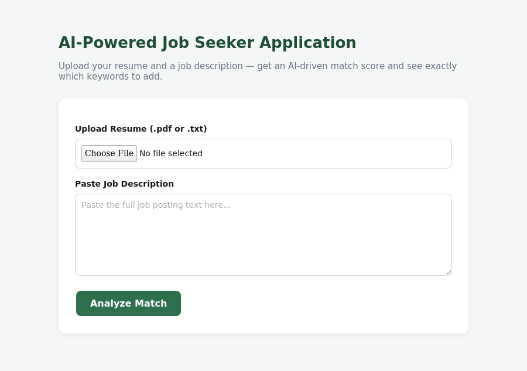
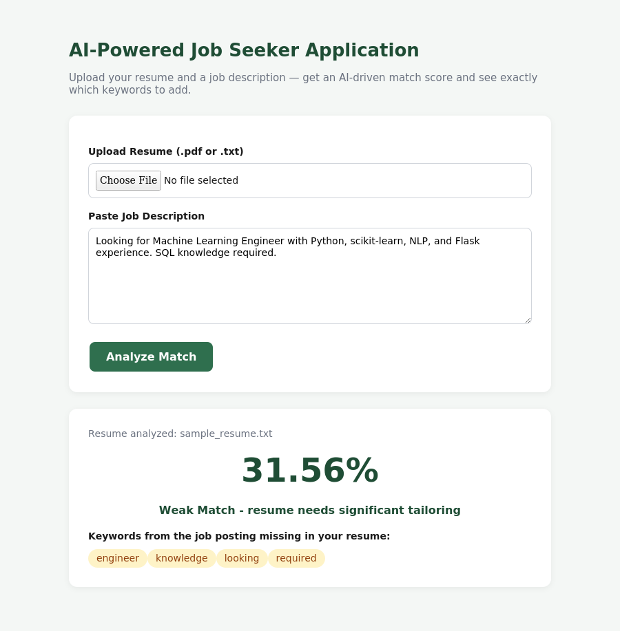

# AI-Powered Job Seeker Application

**B.Tech Major Project | School of Computer Science and Engineering, IILM University**

This repository contains the project report, presentation, and source code for the **AI-Powered Job Seeker Application** — a resume-to-job-description matching tool built using Natural Language Processing (NLP).

---

## 👤 Student Details

| Field           | Details                                     |
| --------------- | --------------------------------------------|
| **Name**        | Suchet Khemraj                              |
| **Roll Number** | 25SCS1003005619                             |
| **Institute**   | IILM University, Greater Noida, U.P.        |
| **Programme**   | B.Tech CSE, Batch 2024–28                   |
| **Project**     | AI-Powered Job Seeker Application           |

---

## 📌 About the Project

Job seekers routinely struggle to know whether their resume is actually a good fit for a job posting, and recruiters spend significant time manually screening resumes against job descriptions. This project addresses that problem by using NLP to automatically compare a candidate's resume against a job description and produce a quantitative match score, along with a list of important keywords missing from the resume.

The system is built with classical, fully explainable NLP techniques — **TF-IDF vectorization** and **Cosine Similarity** — so it runs entirely offline with no paid APIs, GPUs, or external model downloads required.

---

## 🎯 Objectives

- Extract and process text from PDF/TXT resumes automatically
- Apply TF-IDF + Cosine Similarity to compute a quantitative resume–job description match score
- Identify important keywords from the job description missing from the resume
- Build a simple, functional, and beginner-friendly web application using Flask
- Test the system on realistic resume/job-description pairs and validate the results

---

## ⚙️ How It Works

| Step | Module | Description |
| ---- | ------ | ----------- |
| 1 | Text Extraction | Resume text pulled from PDF/TXT using `pypdf` |
| 2 | Text Cleaning | Lowercasing, punctuation removal, stopword filtering |
| 3 | TF-IDF Vectorization | Resume & job description converted into weighted numeric vectors |
| 4 | Cosine Similarity | Vector angle compared → percentage match score |
| 5 | Keyword-Gap Analysis | Important job-description terms missing from the resume are surfaced |

---

## 🖥️ Screenshots

**Application Home Page**



**Match Score & Missing Keywords Result**



---

## 🛠️ Technologies & Tools

`Python 3` · `Flask` · `scikit-learn` (TfidfVectorizer, Cosine Similarity) · `pypdf` · `HTML` / `CSS`

---

## 📁 Repository Contents

```
├── Internship_Report_Suchet_Khemraj.pdf         # Full project/internship report
├── AI_Job_Seeker_Presentation.pdf                # Presentation deck
├── Suchet Chetan Khemraj-Internship Certificate.pdf   # Completion certificate
├── screenshots/
│   ├── screenshot_home.png                       # Application home page
│   ├── screenshot_result.png                     # Match score + missing keywords result
│   └── architecture.png                          # System architecture diagram
└── README.md                                     # This file
```

---

## 📄 Report Structure

1. Candidate's Declaration
2. Acknowledgement
3. Abstract
4. Introduction
5. Objectives
6. Literature Survey
7. System Requirements
8. System Architecture
9. Methodology / Algorithm
10. Implementation
11. Results and Discussion
12. Testing
13. Conclusion and Future Scope
14. References

---

## ▶️ Running the Project

```bash
pip install flask scikit-learn pypdf
python app.py
```

Then open `http://localhost:5000` in your browser, upload a resume (PDF/TXT), paste a job description, and click **Analyze Match**.

---

## ✅ Sample Test Result

| Field | Value |
| ----- | ----- |
| **Resume** | `sample_resume.txt` |
| **Job Description** | "Looking for Machine Learning Engineer with Python, scikit-learn, NLP, and Flask experience. SQL knowledge required." |
| **Match Score** | 31.56% |
| **Verdict** | Weak Match — resume needs significant tailoring |
| **Missing Keywords** | engineer, knowledge, looking, required |

---

## 🔮 Future Scope

- Semantic matching using Sentence-BERT embeddings
- AI-generated resume improvement suggestions
- Live integration with job-listing APIs (LinkedIn, Indeed)
- User accounts to track match-score history over time

---

## 🙏 Acknowledgement

Thanks to the faculty of the Department of Computer Science and Engineering, IILM University, for their guidance and support throughout this project.

---

**Suchet Khemraj** · B.Tech CSE· IILM University, Greater Noida
